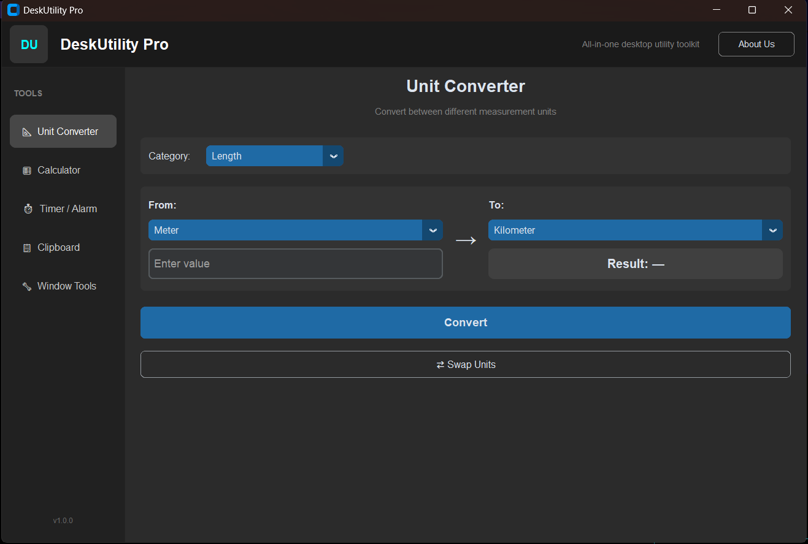
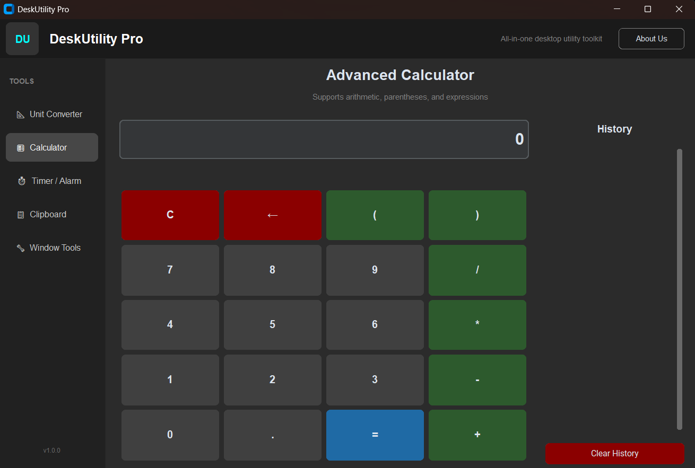
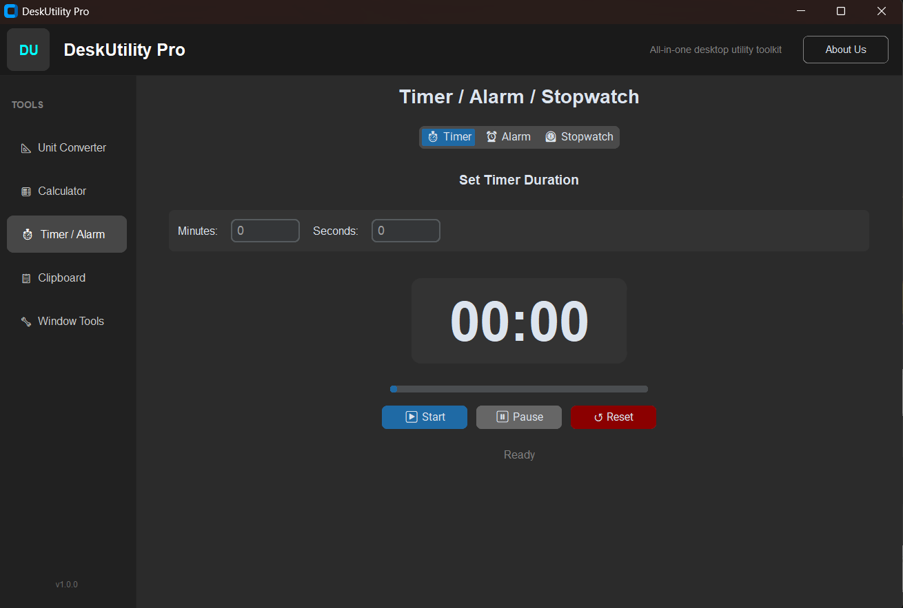

# 🧰 DeskUtility Pro


**DeskUtility Pro** is a powerful, lightweight, and single-file desktop application designed to boost your productivity. Built with modern Python and CustomTkinter, it bundles essential daily tools into one beautifully designed, dark-themed interface.

---

## 🚀 Key Features

### 📐 Unit Converter
Convert values seamlessly across 5 major categories:
- **Length, Weight, Speed, Volume, and Temperature.**
- Instant calculation with improved UI and **auto-convert** on unit swap.

### 🧮 Advanced Calculator
More than just a basic calculator:
- Supports complex expressions, parentheses and operator priority.
- Built-in **History Panel** to review previous calculations.
- Full keyboard support for fast input.

### ⏱ Time Center (Timer / Alarm / Stopwatch)
Reliable and responsive time tools:
- **Timer:** Countdown with visual progress bar and smooth updates.
- **Alarm:** Set a 24-hour alarm that triggers accurately.
- **Stopwatch:** Millisecond precision with Lap recording.

### 📋 Clipboard Manager
Never lose copied text again:
- Automatically monitors your system clipboard.
- Stores up to 30 recent items.
- Click to select and one-click restore to clipboard.

### 🔧 Window Tools
Control the application window behavior:
- **Always On Top:** Keep the app above all other windows.
- **Window Opacity:** Adjust transparency from 50% to 100%.

---

## ✨ What's New in v1.1.0

- **Major Stability Improvement**: Replaced all background threads with safe `after()` loops (no more threading issues or crashes).
- Fixed critical bug in CalculatorFrame (duplicate UI method).
- Significantly improved UI consistency and visual polish across all tools.
- Better responsiveness in Timer, Stopwatch and Clipboard Manager.
- Enhanced Swap button in Unit Converter (now auto-converts).
- General code cleanup and improved keyboard handling.

---

## 📸 Screenshots
<div align="center">
  
  
  
</div>

---

## 💻 Installation & Usage

### Method 1: Run with Python
1. Clone the repository:
   ```bash
   git clone https://github.com/MRThugh/DeskUtility.git
   cd DeskUtility
   ```
2. Install the required dependencies:
   ```bash
   pip install customtkinter pyperclip
   ```
3. Run the application:
   ```bash
   python main.py
   ```

### Method 2: Build Standalone Executable (.exe)
```bash
pip install pyinstaller
pyinstaller --onefile --windowed --icon=icon.ico --name="DeskUtility Pro" main.py
```

---

## 🤝 Contributing
Contributions, issues, and feature requests are welcome!  
Feel free to fork the project and submit a Pull Request if you want to add new tools.

---

**Made with ❤️ by Ali Kamrani (MRThugh)**  
[GitHub Profile](https://github.com/MRThugh)

⭐ **If you find this tool useful, please give it a star!**
